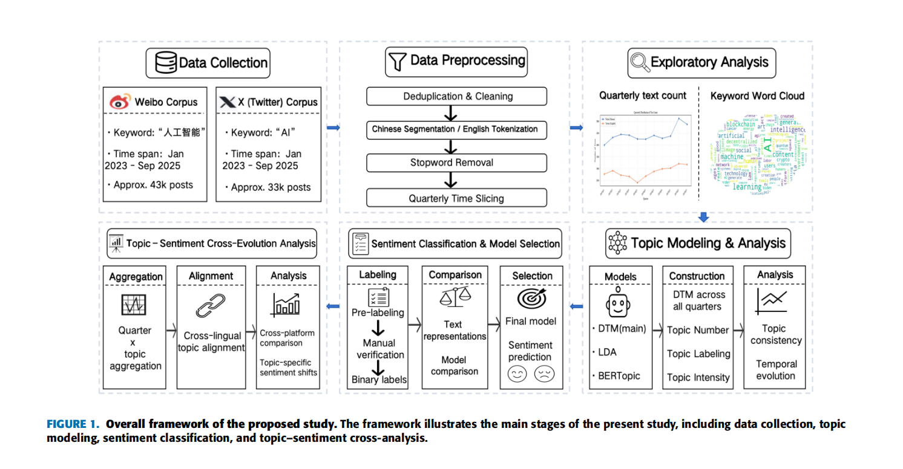

# Sentiment-Dynamics-of-AI-Discourse

This repository contains the code, intermediate results, and analysis materials for the study:

**Cross-Context Topic Evolution and Sentiment Dynamics of AI Discourse on Weibo and Twitter**

The project focuses on AI-related public discourse on **Chinese Weibo** and **English Twitter/X**, and studies their **topic evolution** and **sentiment dynamics** across time and platforms.

---

## 1. Project Overview

With the rapid development of artificial intelligence, discussions on AI applications, governance, ethics, industrial deployment, and public attitudes have expanded rapidly across social media platforms. This project constructs a **cross-context analysis framework** to compare AI discourse in Chinese and English social media from two aspects:

- **Topic evolution**
- **Sentiment dynamics**

The study uses:

- **Weibo corpus (Chinese)**
- **Twitter/X corpus (English)**

and combines:

- **Dynamic Topic Model (DTM)**
- **LDA**
- **BERTopic**
- **Sentiment classification models**

to analyze how AI-related discussions change over time and across platforms.

---

## 2. Research Objective

The main goals of this project are:

1. To identify the major AI-related topics discussed on Weibo and Twitter/X.
2. To trace how these topics evolve over quarterly time slices.
3. To compare topic structures across Chinese and English contexts.
4. To build sentiment classification models for both corpora.
5. To analyze the cross-evolution of **topic intensity** and **sentiment polarity**.

---

## 3. Data Description

### Chinese corpus
- Platform: **Weibo**
- Keyword: **人工智能**
- Time span: **2023-01 to 2025-09**
- Size: approximately **43k posts**

### English corpus
- Platform: **Twitter / X**
- Keyword: **AI**
- Time span: **2023-01 to 2025-09**
- Size: approximately **33k posts**

---

## 4. Overall Framework

The overall workflow of this project is shown below.



The framework includes the following main stages:

1. **Data collection**
2. **Data preprocessing**
3. **Exploratory analysis**
4. **Topic modeling and topic analysis**
5. **Sentiment classification and model selection**
6. **Topic-sentiment cross-evolution analysis**

---

## 5. Main Methodology

### 5.1 Topic Modeling
This project uses three topic modeling approaches:

- **DTM (Dynamic Topic Model)**  
  Used as the main model to capture topic evolution across all quarters in a unified temporal framework.

- **LDA (Latent Dirichlet Allocation)**  
  Used as a comparative baseline for static quarterly topic modeling.

- **BERTopic**  
  Used as another comparative baseline to evaluate topic interpretability and consistency.

### 5.2 Sentiment Classification
Sentiment analysis is conducted separately for Chinese and English corpora. Multiple models are compared, and the best-performing model for each language is selected.

- **Best Chinese sentiment model: M2**
- **Best English sentiment model: M3**

These best models are then used for downstream **topic-sentiment cross-analysis**.

---

## 6. Best Sentiment Models

### Chinese sentiment classification
The best-performing model for the Chinese corpus is:

- **M2**

This model is used as the final Chinese sentiment classifier for topic-level sentiment aggregation and longitudinal analysis.

### English sentiment classification
The best-performing model for the English corpus is:

- **M3**

This model is used as the final English sentiment classifier for topic-level sentiment aggregation and cross-platform comparison.

---

## 7. Environment Requirements

The project was developed and tested under the following environment:

### Basic environment
- **Python**: 3.10.18
- **OS**: Darwin 25.2.0
- **Machine**: arm64
- **Processor**: arm

### Python executable
- `/opt/anaconda3/envs/nlp-en/bin/python`

### Key package versions
- **numpy**: 1.26.4
- **pandas**: 2.3.3
- **scikit-learn**: 1.7.2
- **torch**: 2.9.0
- **transformers**: 4.51.2
- **matplotlib**: 3.10.7
- **seaborn**: 0.13.2
- **gensim**: 4.3.3

---

## 8. Recommended Installation

It is recommended to create a dedicated conda environment first.

```bash
conda create -n ai_discourse python=3.10
conda activate ai_discourse
